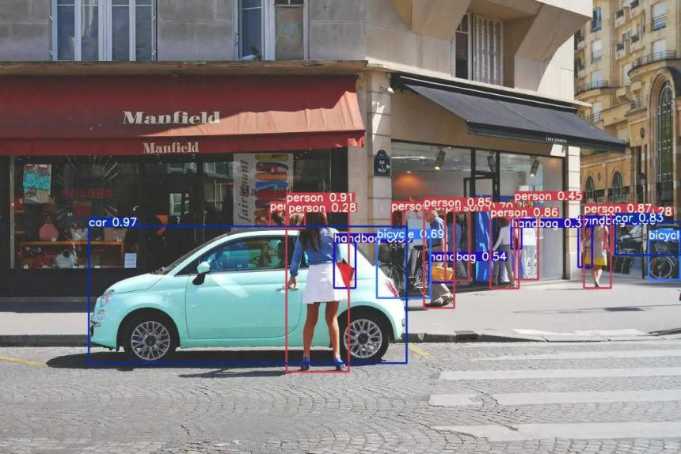

# Real-Time Object Detection System

A comprehensive object detection system that leverages the state-of-the-art YOLOv10 algorithm for real-time detection on images and video streams. This project is designed for ease of use and rapid deployment, making it simple to integrate into various applications.

## Features

- **Real-Time Detection:** Quickly identifies objects in both images and live video feeds.
- **High Accuracy:** Utilizes YOLOv10 for state-of-the-art object detection performance.
- **Multi-Format Support:** Works with image files, video files, and live webcam feeds.
- **Customizable Parameters:** Easily adjust confidence and non-maximum suppression (NMS) thresholds.
- **Visual Output:** Annotates detections with bounding boxes and class labels.

## Installation

### Prerequisites

- **Python 3.11+**
- **OpenCV**
- **PyTorch & Torchvision**
- **NumPy**
- **YOLOv10 Weights:** Download from the official YOLOv10 repository or a trusted source.

## Contributing
### Contributions are welcome! To contribute:
### Fork the Repository.
- **Create a New Branch (e.g., git checkout -b feature/your-feature).
- **Commit Your Changes with clear, descriptive messages.
- **Push to Your Branch and create a pull request detailing your modifications.
- **Please adhere to the project’s coding standards and include tests where applicable.

## License
### This project is licensed under the MIT License. See the LICENSE file for more details.

## Acknowledgements
- **OpenCV: For providing robust computer vision tools.
- **YOLOv10: For state-of-the-art object detection capabilities.
- **PyTorch: For powering the deep learning framework behind the model.
- **The Open-Source Community: For continuous contributions and support.

# Contact
## For questions, suggestions, or support, please contact:

- **Sahil Sunil Patil
- **Email: sahilpatil.2422@gmail.com
- **GitHub: SahilPatil-codes
